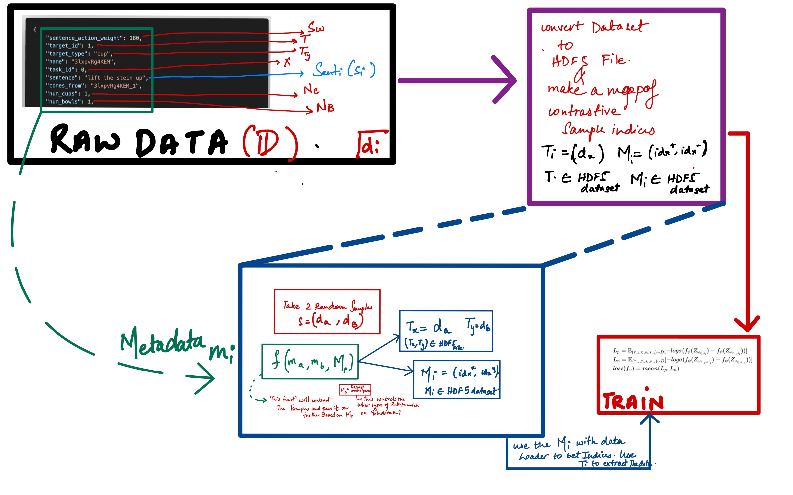

# Dataloaders

# Dataloader for Mountain Car. 
[This file](../language_conditioned_rl/dataloaders/mountaincar/dataset.py) consists of the entire data loading process for the mountain car experiments. 

# Dataloader For Robotics Experiments

There are three main datasets. :

1. **Demonstrations** : `DemonstrationsDataset` (HDF5 dataset) with all demos and associated index `id_list` within it to hold all the index of each record. 
    - We create this dataset if there is a change in the channels the transformer will attend to.  
    - Ideally it this happens once if the `use_channels` don't change. 
    - `H5DataCreatorMainDataCreator` will create the demonstrations in the `h5py` file format.  
    - `DemonstrationsDataset` is the PyTorch `Dataset` to help load the `h5py` demonstrations. 

2. **Metadata** : `metadata` about each id in the `id_list`. Ideally as a CSV dataframe
    - We create this dataset once. 

3. **Contrastive Pairs** : using the `demo_set` and `metadata` we create the `contrastive_set` for training and testing. 
    - We create this dataset using control parameters (`CP`). 
    - These control parameters determine the distribution over different forms of contrasting behaviours. Like Picking Pouring. ETC
    - They will help make a train and test distribution. 
    - Instantiate the DataLoader with `DataLoader(collate_fn=ContrastiveCollateFn,**whatever_your_kwargs)`